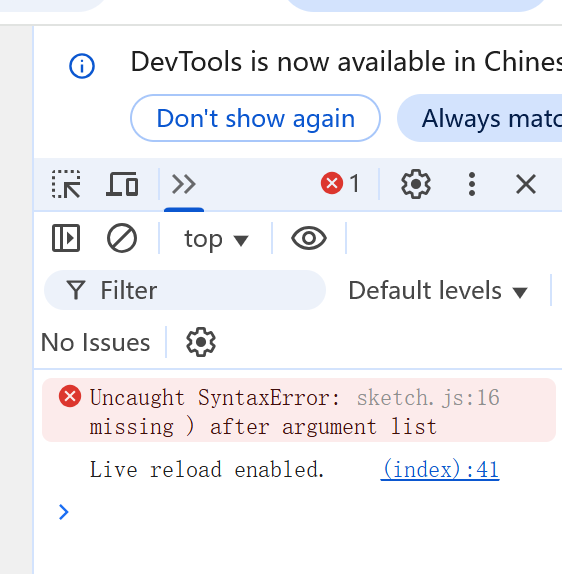
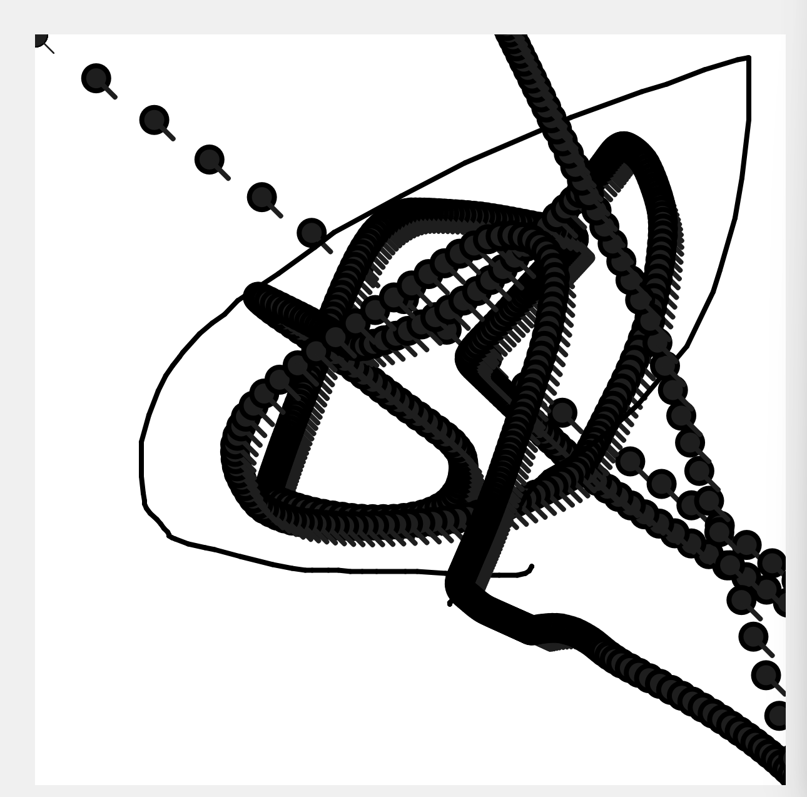

# modulo_operator

## Getting Started

Open `index.html` in your web browser and start editing `sketch.js`.

## Running Locally

For projects with media files, use a local server:

```bash
# Using Python
python -m http.server 8000

# Using Node.js
npx http-server

# Using VS Code Live Server extension
# Right-click index.html -> "Open with Live Server"
```

## Resources

- [p5.js 2.0](https://beta.p5js.org/)
- [p5.js Reference](https://p5js.org/reference/)


During the early stages of development, a typical compile-time syntax error (Uncaught SyntaxError) occurred due to a missing closing parenthesis. Meanwhile, overlapping coordinates caused the UI elements to obscure each other, preventing proper interaction.


A logical error in the rendering pipeline. Because the code failed to apply a local alpha-erase to the previous frame while updating the insect's position in draw(), the ants left severe ghosting artifacts and trailing black lines as they moved. This issue was perfectly resolved by introducing a localized semi-transparent overlay fading mechanism.